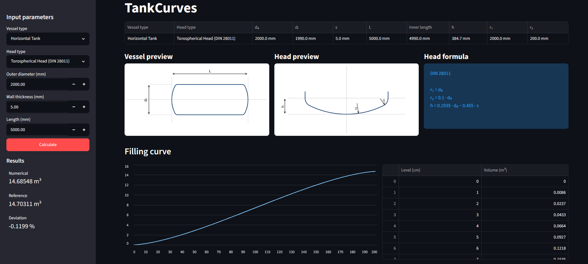

# TankCurves

Engineering tool for generating filling curves of horizontal and vertical storage tanks with multiple vessel head geometries.

TankCurves calculates the relationship between liquid level and contained volume and provides graphical visualization, tabular results, Excel export, and built-in volume verification.



---

## Features

### Vessel Types

* Horizontal tanks
* Vertical tanks

### Supported Head Geometries

* Flat heads
* Hemispherical heads
* Elliptical heads (2:1)
* Torospherical heads (DIN 28011)
* Torospherical heads (DIN 28013)

### Engineering Features

* Numerical filling curve calculation
* Analytical and engineering reference volume validation
* Automatic deviation reporting
* Internal geometry calculation from wall thickness
* Metric and Imperial unit support

### Visualization

* Vessel geometry preview
* Head geometry visualization
* Interactive filling curve plotting
* Level-volume lookup table

### Export

* Excel export (.xlsx)
* Geometry summary export
* Filling curve export

### User Interface

* Interactive Streamlit web application
* Metric units (mm, cm, m³)
* Imperial units (inch, US gal)

---

## Why TankCurves?

Many online tank volume calculators only provide total vessel volume.

TankCurves generates complete filling curves, supports multiple engineering head geometries, validates results against reference calculations, and exports ready-to-use calibration tables for industrial applications.

---

## Example

For a horizontal vessel with:

| Parameter      | Value                          |
| -------------- | ------------------------------ |
| Outer Diameter | 2000 mm                        |
| Wall Thickness | 5 mm                           |
| Length         | 5000 mm                        |
| Head Type      | Torospherical Head (DIN 28011) |

TankCurves calculates:

* Total vessel volume
* Filling curve
* Level-volume lookup table
* Engineering reference volume
* Relative deviation

---

## Installation

Clone the repository:

```bash
git clone https://github.com/nfworx/tankcurves.git
cd tankcurves
```

Install dependencies:

```bash
pip install -r requirements.txt
```

---

## Run the Application

```bash
streamlit run app.py
```

The application will open automatically in your browser.

---

## Project Structure

```text
tankcurves/
│
├── calculation/            # Numerical calculation algorithms
├── drawing/                # Vessel and head visualizations
├── tests/                  # Automated test suite
├── models.py               # Geometry models
├── app.py                  # Streamlit application
├── requirements.txt
└── pytest.ini
```

---

## Calculation Workflow

1. Define vessel geometry
2. Calculate internal dimensions
3. Generate vessel radius profile
4. Calculate liquid cross-sections
5. Numerically integrate vessel volume
6. Generate filling curve
7. Validate results against reference calculations
8. Export results to Excel

---

## Numerical Verification

TankCurves compares numerically calculated vessel volumes against analytical or engineering reference calculations.

### Analytical Reference Geometries

* Flat Head
* Hemispherical Head
* Elliptical Head 2:1

### Engineering Reference Geometries

* Torospherical Head (DIN 28011)
* Torospherical Head (DIN 28013)

The reported deviation is intended for software verification and regression testing.

For torospherical heads, the reported deviation represents agreement with the selected engineering reference method and should not be interpreted as a certified measure of physical accuracy.

---

## Automated Testing

TankCurves includes an automated pytest test suite covering:

* Filling curve generation
* Reference volume calculations
* Radius profile generation
* Geometry calculations
* Numerical integration routines

All tests are executed automatically through GitHub Actions on every push and pull request.

---

## Future Improvements

* Additional head geometries
* Tilted tank support
* Additional export formats
* Improved visualizations
---

## License

MIT License
